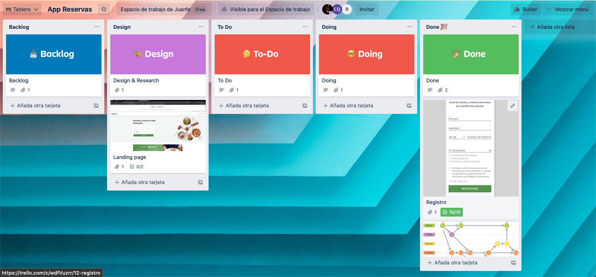

<a name="top"></a>

<h1>App Bookings Restaurants</h1>


🧐 [About](#id1)   

💻 [Technologys](#id2)

:clipboard: [Instructions](#id3)

⚙️ [Phase I backend development](#id4)


---

<a name="id1"></a>
## **About**

This is the backend for a restaurant reservation application.

This project is part of the Full Stack Developer Bootcamp taught by [GeeksHubs Academy](https://bootcamp.geekshubsacademy.com/).

---
**Phase I**
**Start Date:** 01/ jun /2021
**Deadline:** 07 / jun / 2021

**Collaborators:**
* [Carlos Quintero Moreno](https://github.com/CarlosRQuinteroM)
* [Juan Felipe Porras Gallego](https://github.com/juanfegallego)

---

<a name="id2"></a>

## **Technologies**

These are the technologies with which we have worked in this project:
         <details><summary>Click to expand trello picture</summary></details>


<a name="id3"></a>
***
## **Instructions**
<details>

<summary>Click to expand</summary>

<br>

- [Download](https://nodejs.org/es/) e Download <b>Node.</b>
```
    $ npm install node
```
- Download <b>Nodemon.</b>
```
    $ npm install nodemon
```
- Download <b>Express.</b>
```
    $ npm install express
```
- Download <b>mongoose.</b>
```
    $ npm install mongoose
```
- Download <b>bcrypt.</b>
```
    $ npm install bcrypt
```
- Download <b>jsonwebtoken.</b>
```
    $ npm install jsonwebtoken
```
- Download <b>Cors.</b>
```
    $ npm install cors
```
- Download <b>Validator.</b>
```
    $ npm install validator
```


</details>

<a name="id4"></a>
## Phase I Backend development
<!-- <details> -->
<summary>Click to expand</summary>

The project consists of the development of a reserve management system.

We work with an internal database that is hosted in <b>MongoDB Atlas</b> and with its own API.

The endpoints worked are:

<b>User</b>

- User Creation
  http://localhost:3000/user + User data through the body
  ````
  {
    "name": "ejemplo",
    "surname": "insertar apellidos",
    "email": "ejemplo@correo.com",
    "password": "contraseña",
    "phoneNumber": 612345678,
    "country": "insertar País",
    "city": "insertar Ciudad",
    "birthday": "YYYY/MM/DD",
    "isAdmin": true/false,
    "isActive": true/false
  }
  ````
- Login Users
  http://localhost:3000/user/login + User credentials by body.
  ````
  {
    "email": "ejemplo@correo.com",
    "password": "contraseña"
  }
  ````
- Delete Users
http://localhost:3000/user/ (:id<UserId>) + Admin Token

- Search for all users
http://localhost:3000/user + Admin Token

<br>

---

<b>Restaurants</b>

-Creation Restaurant
http://localhost:3000/rest/create +Restaurant Data
````
{
    "name":,
    "country":,
    "city":,
    "bookings":[],
    "isActive": 

}
````
- Restaurant List
http://localhost:3000/rest
<br>
---


<b>Bookings</b>

- Create Bookings
http://localhost:3000/rest/add +  Data booking by body
````
{
    "id":"60b8a3bd1f08426c7cacb336",
    "userId":"60b66bed4920d7121a06f05b",
    "comensales":"reserva para 8 personas",
    "fecha":"2021-05-06",
    "hora":"19:00",
    "alergias":"celiaco",
    "comentarios":"trona de bebe"
}
````

- Delete Bookings 
http://localhost:3000/rest +  Data booking by body
{
    "id" :"60b79ecf2b356425940d4edb",
    "idRestaurante":"60b8a3bd1f08426c7cacb336"
}
```

http://localhost:3000/rest
- List of all restaurant reservations
http://localhost:3000/rest/bookings + el ID del restaurante por body

```
{
    "id":"60b8a3bd1f08426c7cacb336"
}
</details>

[](https://app.getpostman.com/run-collection/532d6afed35da38b6876?action=collection%2Fimport)
<a name="id5"></a>

<a name="id6"></a>


***
[:top:](#top)